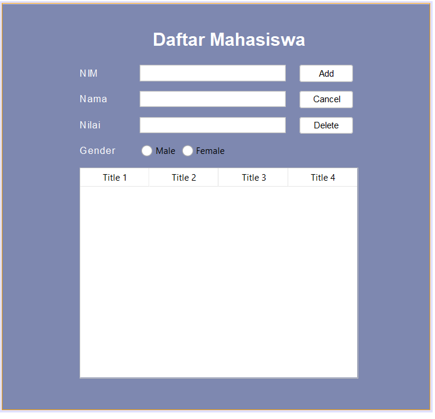
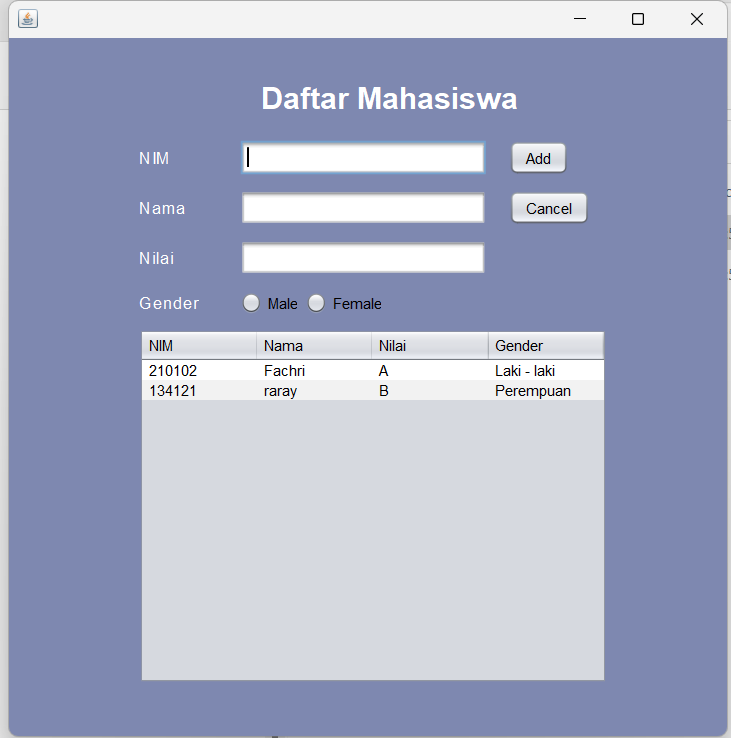

## Janji
Saya Fachri Najm Noer Kartiman NIM 2106515 mengerjakan soal Latihan 5
dalam mata kuliah Desain Pemrograman Berorientasi Objek untuk keberkahanNya
maka saya tidak melakukan kecurangan seperti yang telah dispesifikasikan.
Aamiin.

# Tugas LATIHAN5DPBO2023
Download this starter project: [Starter Project](https://drive.google.com/file/d/1TEnEay74nhGcSS9PPzQcxksIlaQhTiZ2/view?usp=sharing) 
* Add more property (component type: any, except text field)
* Add method to reset form
* Refresh table after update and delete
* Add confirmation prompt before delete
* Build project (generate .jar file)

File README berisi desain program, penjelasan alur, dan dokumentasi saat program dijalankan (screenshot/screen record)

Submit link repository pada form berikut: [Form Pengumpulan](https://forms.gle/rvb1hKxbQVuYNbhKA) 

## Desain Program
Desain yang saya buat menggunakan 2 Class:
* Mahasiswa

`Class Mahasiswa` :
* **NIM** -> NIM mahasiswa, `string`
* **Nama** -> Nama mahasiswa, `string`
* **Nilai** -> Nilai mahasiswa, `string`
* **gender** -> Gender mahasiswa, `string`

_Semua Class diatas dilengkapi dengan setter dan getternya_

## Design GUI

## Alur Program Program GUI

## Dokumentasi
**JAR FILE**

